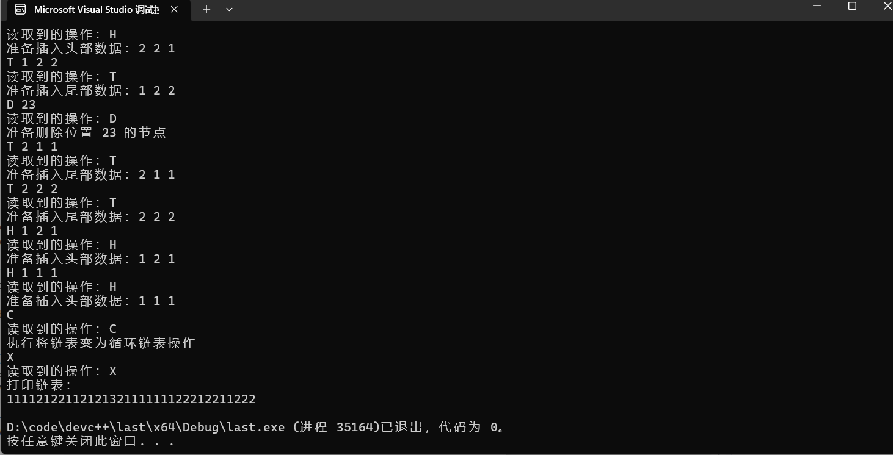
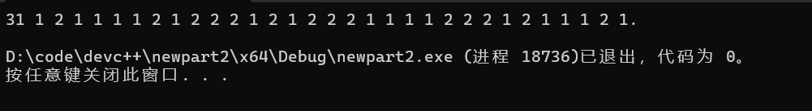
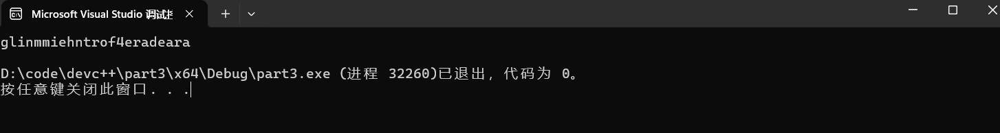

# CS-EASY-02
## 常用数据结构类型
##### 什么是随机存取？这个性质属于哪种线性表的特征？
指能随机访问数据结构中的元素而不需要遍历整个结构  
数组（顺序表）的特征
##### 什么是指针？如何在C语言中定义指针变量？指针变量的大小是固定的吗？
指针是一个储存其他变量的内存地址的变量  
定义指针：数据类型 *指针变量名  
例如 int *ptr  
是固定的，受操作系统位数决定（也可能受编译器影响）
##### 你能为不同的数据结构设想出适用的具体情况吗？
应用场景  
数组：储存100以内的质数  
链表：菜单  
栈：在盒子里可能有盒子和钥匙，栈结构可以用于寻找钥匙  
队列：确认是否是回文联  
图：地图最短路径搜索  
## 数据结构的应用
### Part 1.圈圈圆圆圈圈

在这一小节，你将实现一个环形链表，它的具体实现方式可以粗略地理解为在单链表的基础上，将链表尾节点的后继指向该链表的头节点。因此，你可以对单链表进行操作，并在最后完成环形链表的构建。要求如下：
对于每一个链表节点，仅存储一个正整数作为data信息
起始状态下，链表仅包含一个data等于1的节点作为头节点
你需要实现该链表HTDC操作。

    #include <stdio.h>
    #include <stdlib.h>

    // 链表节点结构
    typedef struct Node {
        int data;
        struct Node* next;
    } Node;

    // 创建新节点    
    Node* createNode(int data) {
        Node* newNode = (Node*)malloc(sizeof(Node));
        newNode->data = data;
        newNode->next = NULL;
    return newNode;
    }

    // 在链表头部插入节点
    void insertAtHead(Node** head, int data) {
        Node* newNode = createNode(data);
        newNode->next = *head;
   
    // 如果链表不为空，更新尾节点的 next 指针
        if (*head != NULL && (*head)->next != *head) {
            Node* temp = *head;
            while (temp->next != *head) {
            temp = temp->next;
        }
        *head = newNode;
        temp->next = *head;
        }
    }
        // 在链表尾部插入节点
    void insertAtTail(Node** head, int data) {  
        Node* newNode = createNode(data);  
        if (*head == NULL) {  
            *head = newNode;  
            newNode->next = *head;  
        return;  
    }  
    Node* temp = *head;  
    while (temp->next != *head) {  
        temp = temp->next;  
    }  
    temp->next = newNode;  
    newNode->next = *head;  
    }  

    // 删除指定位置的节点
    void deleteNodeAtLocation(Node** head, int location) {
    if (*head == NULL) {
        return;
    }
    if (location == 1) {
        Node* temp = *head;
        if ((*head)->next == *head) {
            free(temp);
            *head = NULL;
            return;
        }
        Node* last = *head;
        while (last->next != *head) {
            last = last->next;
        }
        *head = (*head)->next;
        last->next = *head;
        free(temp);
        return;
     }
        Node* prev = *head;
        for (int i = 1; i < location - 1; i++) {
        if (prev->next == *head) {
            return;
        }
        prev = prev->next;
        }
        Node* temp = prev->next;
        prev->next = temp->next;
        free(temp);
    }

    // 将尾节点的后继指向头节点
    void makeCircular(Node** head) {
        if (*head == NULL) {
            return;
        }
        Node* temp = *head;
        while (temp->next != *head) {
            temp = temp->next;
        }
        temp->next = *head;
    }

    // 打印链表
    void printList(Node* head) {
        if (head == NULL) {
            printf("链表为空\n");
        return;
        }
        Node* temp = head;
        do {
            printf("%d ", temp->data);
            temp = temp->next;
         } while (temp != head);
        printf("\n");
    }

    int main() {
        Node* head = createNode(1);
        head->next = head;

        char operation;
        while (scanf_s(" %c", &operation) != EOF) {
            printf("读取到的操作：%c\n", operation);
            if (operation == 'T') {
            int data1, data2, data3;
            scanf_s("%d %d %d", &data1, &data2, &data3);
            printf("准备插入尾部数据：%d %d %d\n", data1, data2, data3);
            insertAtTail(&head, data1);
            insertAtTail(&head, data2);
            insertAtTail(&head, data3);
        }
        else if (operation == 'H') {
            int data1, data2, data3;
            scanf_s("%d %d %d", &data1, &data2, &data3);
            printf("准备插入头部数据：%d %d %d\n", data1, data2, data3);
            insertAtHead(&head, data3);
            insertAtHead(&head, data2);
            insertAtHead(&head, data1);
        }
        else if (operation == 'D') {
            int location;
            scanf_s("%d", &location);
            printf("准备删除位置 %d 的节点\n", location);
            deleteNodeAtLocation(&head, location);
        }
        else if (operation == 'C') {
            printf("执行将链表变为循环链表操作\n");
            makeCircular(&head);
        }
        else if (operation == 'X') {
            break;
        }
    }

        // 检查链表是否为空
        if (head == NULL) {
            printf("链表为空\n");
    }
    else {
        printf("打印链表：\n");
        Node* temp = head;
        do {
            printf("%d", temp->data);
            temp = temp->next;
        } while (temp != head);
        printf("\n");
    }

    // 释放链表内存
    Node* temp = head;
    if (head != NULL) {
        Node* next;
        do {
            next = temp->next;
            free(temp);
            temp = next;
        } while (temp != head);
    }

    return 0;
    }

输出结果为1111212211212132111111122212211222

### Part 2
小明决定将这个问题升级后作为第二部分的考验：  
对于第一部分获得的环形链表，从唯一的数字3的位置开始“报数”，对于“报数”的第m轮，报到m的节点会从链表中删除并将其data输出。（可以发现data为3的这个节点一定会被首先删除掉）直到所有节点均被从环形链表中删除，停止该程序。  
请编写模拟这个过程的代码，并尝试将文件的输出结果保存在Josephus.out文件中。  
        
    #include <stdio.h>
    #include <stdlib.h>
    // 链表节点结构
    typedef struct Node {
        int data;
        struct Node* next;
    } Node;

    // 创建新节点
    Node* createNode(int data) {
        Node* newNode = (Node*)malloc(sizeof(Node));
        newNode->data = data;
        newNode->next = NULL;
        return newNode;
    }

    // 在链表尾部插入节点
    void insertAtTail(Node** head, int data) {
        Node* newNode = createNode(data);
        if (*head == NULL) {
        *head = newNode;
        newNode->next = *head;
        return;
        }
    Node* temp = *head;
    while (temp->next != *head) {
        temp = temp->next;
    }
    temp->next = newNode;
    newNode->next = *head;
    }

    // 找到数字 3 的节点并从该节点开始报数
    Node* findStart(Node* head) {
        Node* temp = head;
        while (temp->data != 3) {
        temp = temp->next;
        }
    return temp;
    }

    // 模拟报数并删除节点
    void josephusProcess(Node** head) {
        Node* curr = *head;  //curr是当前结点指针用于遍历链表
        Node* prev = NULL; //prev是curr后的一个指针
        int round = 1;     //轮数
        int count = 0;    //计数器
        while (curr->next != curr) {     //表示链表中不止一个元素的时候
            count++;          //依次报数
            if (count == round) {
                if (prev == NULL) {
                // 如果 prev 为 NULL，说明要删除的是头节点
                Node* temp = curr;          //创建临时指针，用于清除结点
                curr = curr->next;
                Node* temp2 = *head;
                printf("%d", temp->data);
               
                while (temp2->next != *head) {
                    temp2 = temp2->next;
                }
                *head = curr;
                temp2->next = *head;
                
                free(temp);
                }
            else if (curr != *head) {
                prev->next = curr->next;
                printf("%d ", curr->data);
                Node* temp = curr;
                curr = prev->next;
                free(temp);
            }
            else if (curr == *head) {
                *head = curr->next;
                prev->next = curr->next;
                printf("%d ", curr->data);
                Node* temp = curr;
                curr = prev->next;
                free(temp);
            }
            round++;
            count = 0;

        }
        else {
            prev = curr;
            curr = curr->next;
        }
    }
    printf("%d.\n", curr->data);
    free(curr);
    }

    int main() {
        Node* head = NULL;
        int arr[] = { 1,1,1,1,2,1,1,2,2,1,1,2,1,2,1,3,2,1,1,1,1,1,2,2,2,1,2,2,1,1,2,2,2 };
    for (int i = 0; i < sizeof(arr) / sizeof(arr[0]); i++) {
        insertAtTail(&head, arr[i]);  //为链表输入数据
    }

        Node* start = findStart(head);
        josephusProcess(&start);
        return 0;
    }

输出结果：3,1,1,2,1 ,1,1 ,1 ,2,1 ,2 ,2 ,2 ,1,2 ,1,2 ,2 ,2 ,1,1 ,1 ,1 ,2,2 ,2 ,1,2 ,1 ,1,1 ,2 ,1，  

 ###  Part 3.栈个痛快
这一小结主要围绕栈（zhan，四声）这一数据结构进行操作。在Josephus.out文件中，你已经获得了由一串数字组成的字符串（下称为数字串），现在请结合文件CS-EASY-02-2.txt文件中的字符信息（下称为密文串），完成下列操作。
栈的初始状态不含有任何一个元素  
每次执行压入操作，将按照密文串字符的排列顺序依次进行压入，每个字符仅会被压入一次。  
每次执行弹出操作，从栈顶将一个字符弹出并输出该字符，数据保证不会在空栈情况下进行弹出。  
数字串的信息标示着栈的压入/弹出，具体而言  
奇数位置的数字a代表“执行a次压入操作”  
偶数位置的数字b代表“执行b次弹出操作”  

    #include <stdio.h>
    #include <stdlib.h>

    typedef struct {
        char* data;
        int top;
        int capacity;
    } Stack;

    Stack* createStack(int capacity) {
        Stack* stack = (Stack*)malloc(sizeof(Stack));
        stack->data = (char*)malloc(capacity * sizeof(char));
        stack->top = -1;
    stack->capacity = capacity;
    return stack;
    }

    void push(Stack* stack, char item) {
        stack->top++;
        stack->data[stack->top] = item;
    }

    char pop(Stack* stack) {
        if (stack->top == -1) {
        return '\0';
        }
    char item = stack->data[stack->top];
    stack->top--;
    return item;
    }

    void freeStack(Stack* stack) {
        free(stack->data);
        free(stack);
    }

    int main() {
        // 单个字母表示字符串
    char letterStr[] = { 'k', 'i', 'g', 'l', 'n', 'm', 'r', 'm', 'e', 'i', 'a', 'h', 'e', 'n', 'r', 't', 'e', 'o', 'f', '4', 'a', 'r', 'd', 'a', 'r' };
    // 单个数字表示数字串
    int numStr[] = { 3,1,1,2,1 ,1,1 ,1 ,2,1 ,2 ,2 ,2 ,1,2 ,1,2 ,2 ,2 ,1,1 ,1 ,1 ,2,2 ,2 ,1,2 ,1 ,1,1 ,2 ,1 };

    Stack* stack = createStack(sizeof(letterStr));
    int letterIndex = 0;
    for (int numIndex = 0; numIndex < sizeof(numStr) / sizeof(numStr[0]); numIndex++) {
        int num = numStr[numIndex];
        if (numIndex % 2 == 0) {
            for (int j = 0; j < num && letterIndex < sizeof(letterStr) / sizeof(letterStr[0]); j++) {
                push(stack, letterStr[letterIndex++]);
            }
        }
        else {
            for (int j = 0; j < num; j++) {
                char popped = pop(stack);
                if (popped != '\0') {
                    printf("%c", popped);
                }
            }
        }
    }
        printf("\n");
        freeStack(stack);
        return 0;
    }
输出结果为：glinmmiehntrof4eradeara

